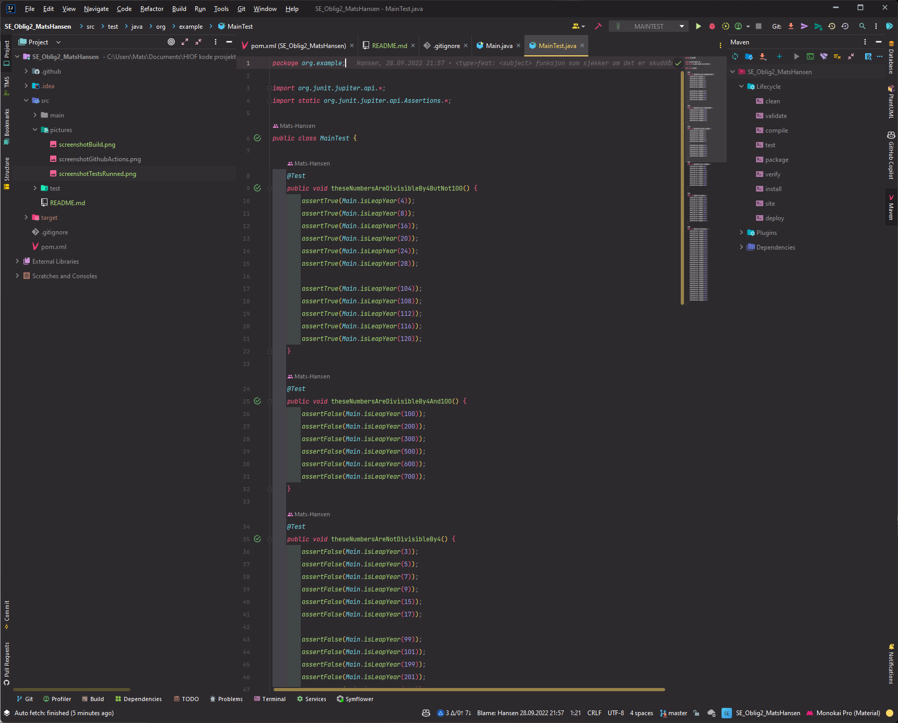
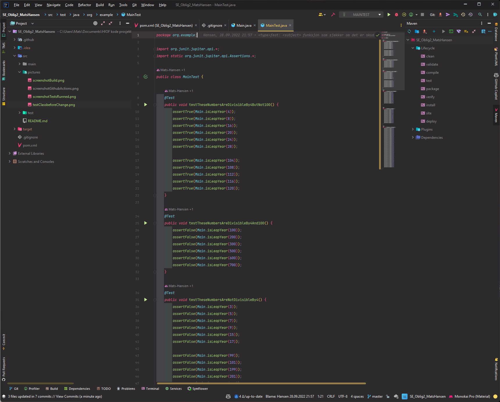
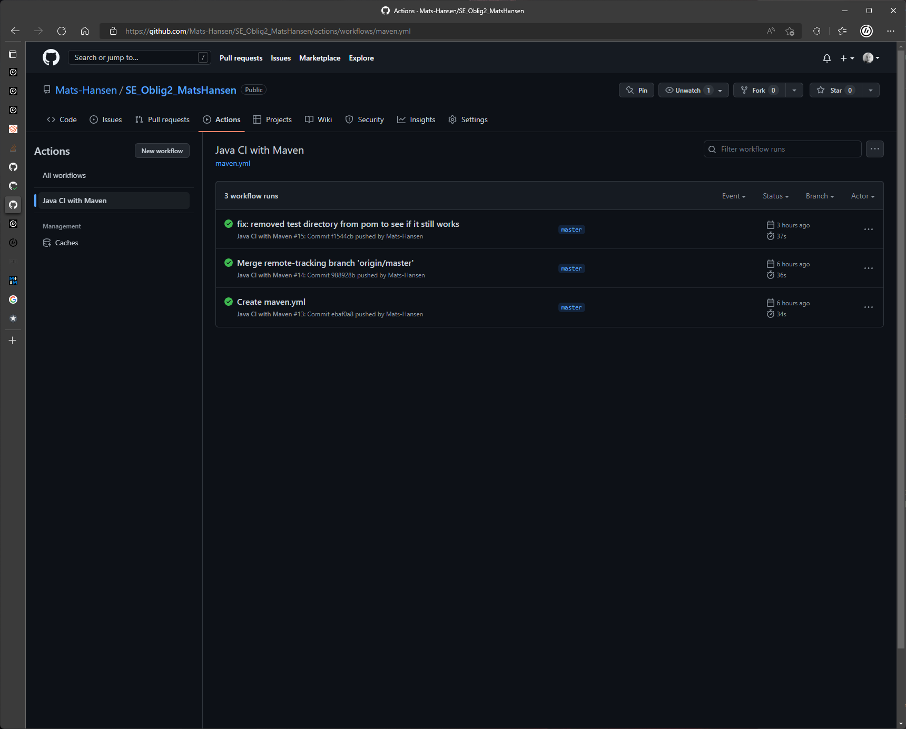
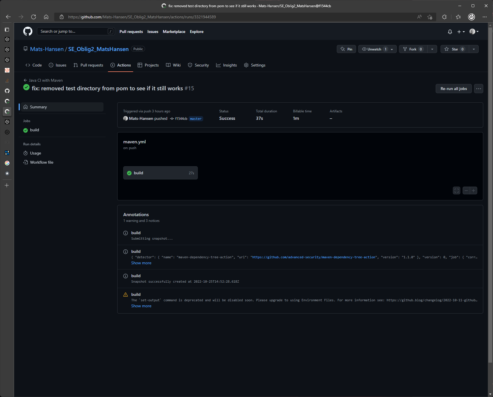
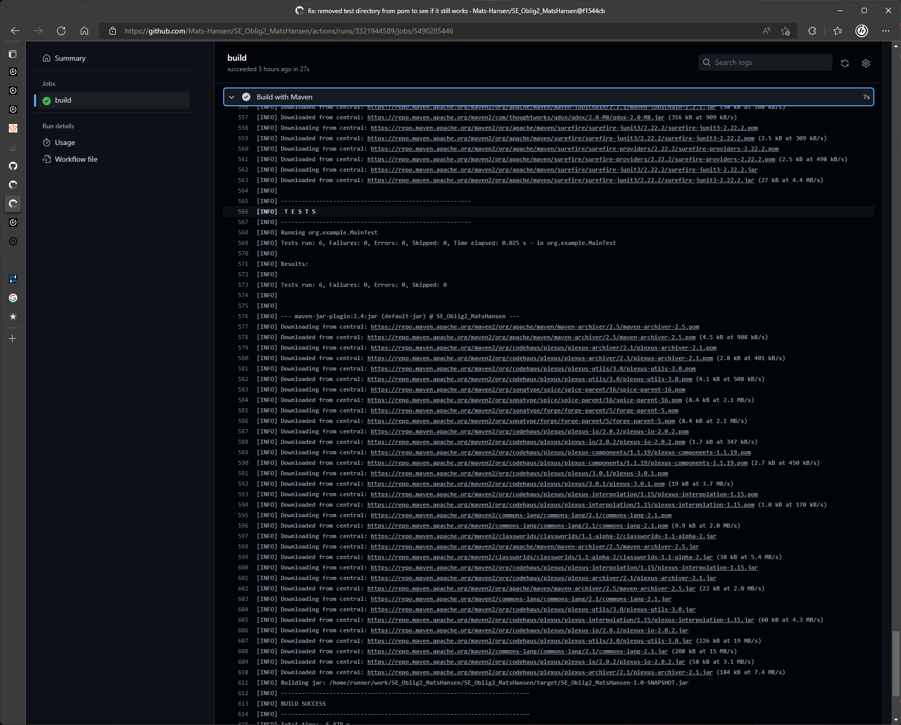

# Oblig 3 - Software engineering


## Dependencies

Slet litt med å få det til å fungere, så jeg gjorde som foreleser foreslo på canvas og la til dette i pom.xml filen.

```xml
<build>
    <plugins>
        <plugin>           
            <artifactId>maven-surefire-plugin</artifactId>  
            <version>2.22.2</version>  
        </plugin>
    </plugins>
</build>  
```

---

## Github actions
Installerte "Java with Maven" workflowen inne på github actions og endret på .yml filen til å den java versjonen jeg har brukt i prosjektet.
    
```yml
# This workflow will build a Java project with Maven, and cache/restore any dependencies to improve the workflow execution time
# For more information see: https://docs.github.com/en/actions/automating-builds-and-tests/building-and-testing-java-with-maven

# This workflow uses actions that are not certified by GitHub.
# They are provided by a third-party and are governed by
# separate terms of service, privacy policy, and support
# documentation.

name: Java CI with Maven

on:
  push:
    branches: [ "master" ]
  pull_request:
    branches: [ "master" ]

jobs:
  build:

    runs-on: ubuntu-latest

    steps:
    - uses: actions/checkout@v3
    - name: Set up JDK 18
      uses: actions/setup-java@v3
      with:
        java-version: '18.0.2'
        distribution: 'temurin'
        cache: maven
    - name: Build with Maven
      run: mvn -B package --file pom.xml

    # Optional: Uploads the full dependency graph to GitHub to improve the quality of Dependabot alerts this repository can receive
    - name: Update dependency graph
      uses: advanced-security/maven-dependency-submission-action@571e99aab1055c2e71a1e2309b9691de18d6b7d6
```

---

## Testing
Oppdaget at testene ikke kjørte når jeg pushet noe opp til github. Etter hvert fant jeg ut at testmetodene måtte hete "testMetodenavn()", etter å endret navnet på alle testene gikk det bedre.







